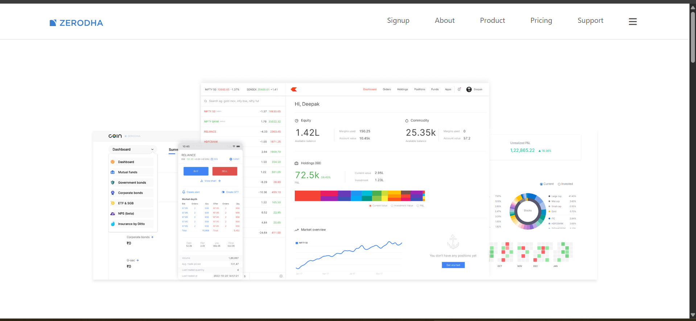
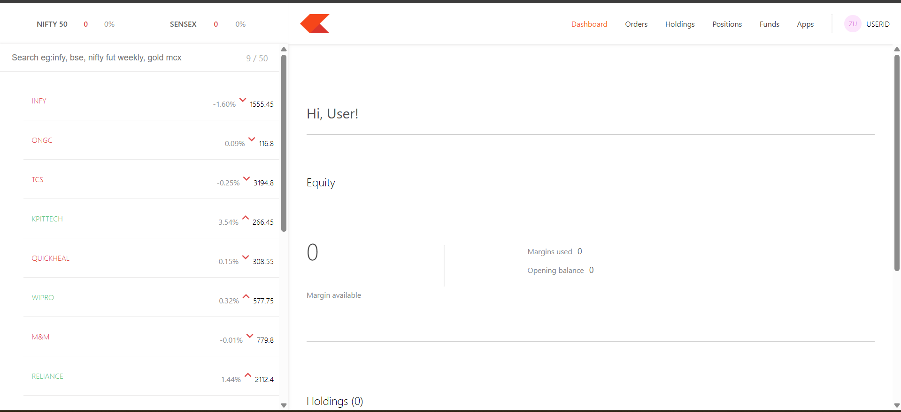
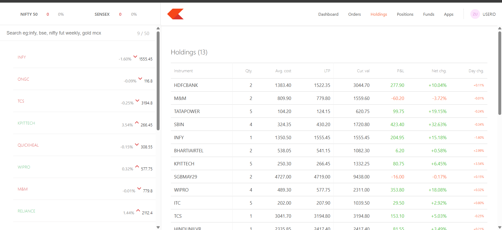

# Zerodha Clone

A full-stack stock trading platform inspired by Zerodha that allows users to manage their investments, view holdings, and track portfolio performance through an interactive dashboard.

---

## Live Demo

### Frontend

Live Demo: https://zerodha-clone-frontend-b924.onrender.com

## 🚀 Features

- User authentication with secure login system
- Interactive trading dashboard
- Portfolio and holdings management
- Buy and sell stock simulation
- Data visualization using charts
- Responsive UI built with Material UI
- REST API based backend architecture

---

## 🛠 Tech Stack

### Frontend

- React.js
- React Router
- Axios
- Material UI (MUI)
- Chart.js
- React Chart.js 2
- React Toastify

### Backend

- Node.js
- Express.js
- MongoDB
- Mongoose
- Passport.js (Authentication)
- JWT Authentication
- Bcrypt.js (Password hashing)

### Other Tools

- Cookie Parser
- CORS
- Dotenv

---

## 📸 Screenshots

### 🏠 Home Page



### 📊 Trading Dashboard



### 📈 Holdings / Portfolio



---

## ⚙️ Installation

Clone the repository

```bash
git clone https://github.com/Mdirfan0786/zerodha-clone.git
```

Navigate to the project folder

```bash
cd zerodha-clone
```

Install dependencies for frontend and backend

```bash
npm install
```

Run the backend server

```bash
cd backend
npm start
```

Run the frontend

```bash
cd frontend
npm start
```

---

## 🌐 Usage

1. Register or login to your account
2. Access the trading dashboard
3. View portfolio and holdings
4. Simulate stock buying and selling
5. Track investment data through charts

---

## 📌 Future Improvements

- Real-time stock price API integration
- Watchlist feature
- Advanced trading analytics
- Notification system for price alerts

---

## 👨‍💻 Author

**MD IRFAN**

---

## 📬 Contact

If you want to connect or collaborate with me:

- **GitHub:** https://github.com/Mdirfan0786
- **Portfolio:** https://apna-portfolio-drab.vercel.app/

---

⭐ If you like this project, please consider giving it a **star** on GitHub!
